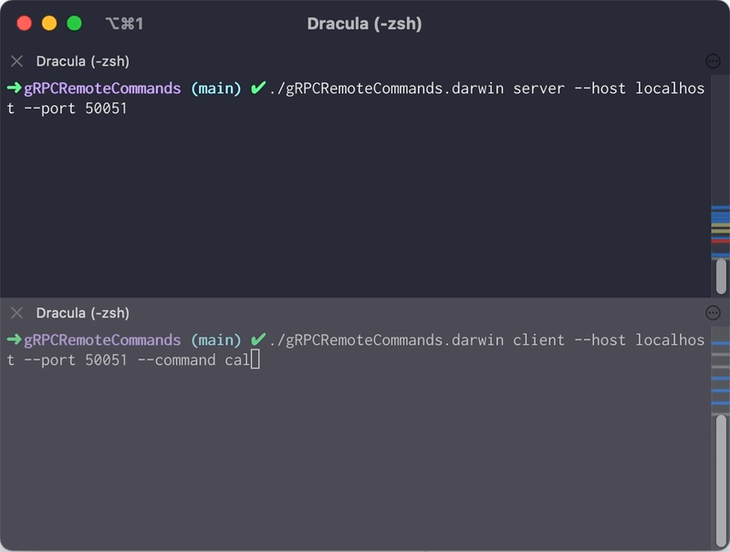

# gRPCRemoteCommands

[](https://github.com/elulcao/gRPCRemoteCommands/actions/workflows/go.yaml)
[](https://github.com/elulcao/gRPCRemoteCommands/actions/workflows/codeql-analysis.yaml)

---

<p
    align="center">
    
</p>

---

`Unary gRPC` demo, with embedded certificates and `TLS` for secure communication between client and
server.

In simple `gRPC`, the client sends a single request to the server and gets a single response that is
sent back to the client. In this case the request is a `command` to be executed on the server and the
response is the `result of the command`.

The connections is secured by `TLS`, which is a transport layer security protocol. This eliminates the
need for SSH keys or passwords. The client and server are configured to use the same  certificate
and key; the certificates are generated locally and then embedded in the code. Having the certificates
embedded in the code makes it easier to distribute the binary server and client, since this is a
demo and not a production application.

```bash
                        ┌─────────┐   ┌────────┐   ┌─────────┐
                        │ Cert C  │◄──┤ CA Auth├──►│ Cert S  │
                        └────x────┘   └────────┘   └────x────┘
                             x                          x
                        ┌────x────┐                ┌────x────┐
                        │         ├───────────────►│         │
                        │         │    gRPC Conn   │         │
                        │         │                │         │
                        │ Client  │                │ Server  │
                        │         │◄───────────────┤         │
                        └─────────┘    gRPC Conn   └──┬──────┘
                                                      │
                                                      │
                                                   ┌──┴──────┐
                                                   │         │
                                                   │ Command │
                                                   └─────────┘
```

The service definition is in the `proto` directory, the simpliest `gRPC` service definition is:

```go
// RemoteCommand is a command to be executed on a remote machine.
service RemoteCommand {
    rpc executeCommand(CommandRequest) returns (CommandResponse) {}
}

// CommandRequest is a request to execute a command.
message CommandRequest {
    string cmd = 1;
}

// CommandResponse is a response to a command.
message CommandResponse {
    string out = 1;
}
```

## Building the server and client

Server and client are using certificates to secure the communication. The certificates are generated
locally and then embedded in the code. This is intended to make it easier to distribute the binary,
there is no need to generate the certificates and propagate them to the client and server since this
is a demo and not a production application; so, only `go 1.16` and above is supported.

To build the server and client, first generate the certificates, then build the protobuf files, then
build the server and client.

All the steps can be done in a single command:

* `make build`

The certificates are generated with the following script:

* `scripts/certs.sh`

The protobuf file is generated with the following command:

* `protoc --proto_path=proto proto/command_service.proto --go_out=proto --go-grpc_out=proto`

Binary generated can be used in the local host since the certificates are generated with IP address
like `0.0.0.0`. Change the IP address to the IP address of the machine where the server is running
and generate the certificates and binary again.

## Building the server and client with the development environment

The devcontianer can be used, `.devcontainer/Dockerfile`, to build the server and client when running
cloned the repo in a Windows machine. The binafiles generated must be used in Linux machines, since
the devcontainer is built with a Linux image.

## Notes

Commands with arguments are allowed but commands that require an interactive shell are not supported,
i.e. `sudo`, `htop`, `top`, `vim`, `vi`.

```bash
./gRPCRemoteCommands client --command "ls -la"
```
